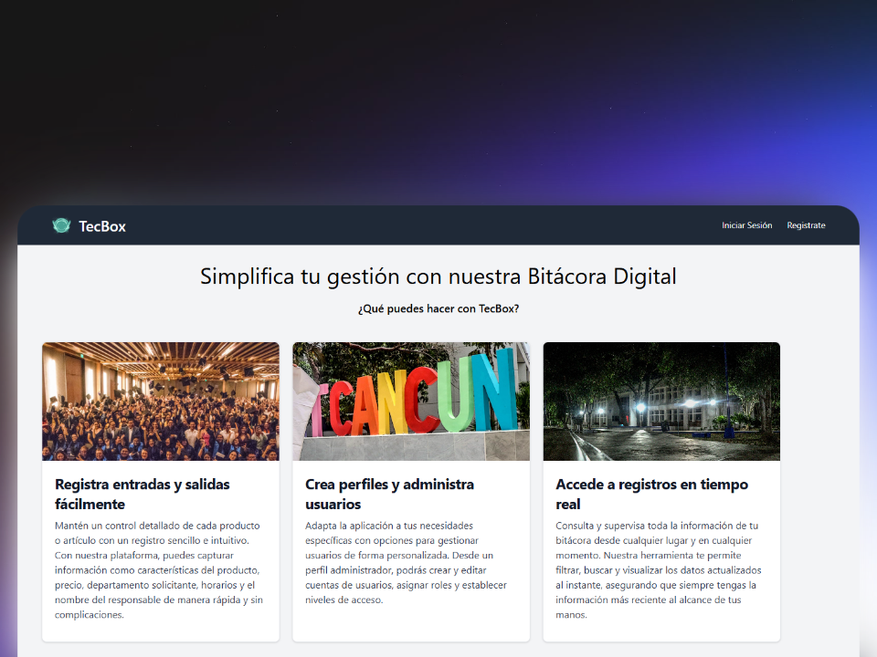

# TecBox

TecBox es una aplicación web diseñada para gestionar y organizar proyectos técnicos. Permite a los usuarios crear, editar y eliminar proyectos, así como asignar tareas y hacer seguimiento del progreso. La aplicación está construida utilizando PHP y MySQL, y se ejecuta en un entorno XAMPP. Es ideal para equipos de desarrollo que buscan una solución sencilla y eficiente para la gestión de proyectos.

## Requisitos
- XAMPP
- PHP
- MySQL

## Instalación
1. Clona el repositorio:
    ```bash
    git clone https://github.com/RasenBunkai/TecBox.git
    ```
2. Navega al directorio del proyecto:
    ```bash
    cd NewTecBox
    ```
3. Configura el entorno en XAMPP y asegúrate de que Apache y MySQL estén corriendo.

## Uso
1. Abre tu navegador y navega al [DashBoard](http://localhost/newtecbox/app/views/Dashboard.php).
2. Sigue las instrucciones en pantalla para comenzar a usar la aplicación.

## Contribución
1. Haz un fork del proyecto.
2. Crea una nueva rama (`git checkout -b feature/nueva-funcionalidad`).
3. Realiza tus cambios y haz commit (`git commit -am 'Añadir nueva funcionalidad'`).
4. Sube tus cambios (`git push origin feature/nueva-funcionalidad`).
5. Abre un Pull Request.

## Licencia
Este proyecto está bajo la Licencia MIT. Consulta el archivo `LICENSE` para más detalles.

## Contacto
Para cualquier consulta, puedes contactarme en mi [X](https://x.com/Rasen_bunkai)